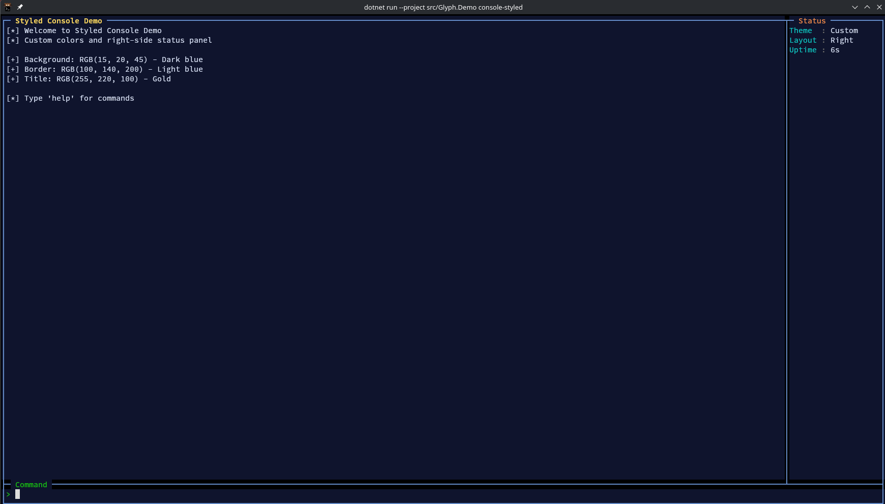
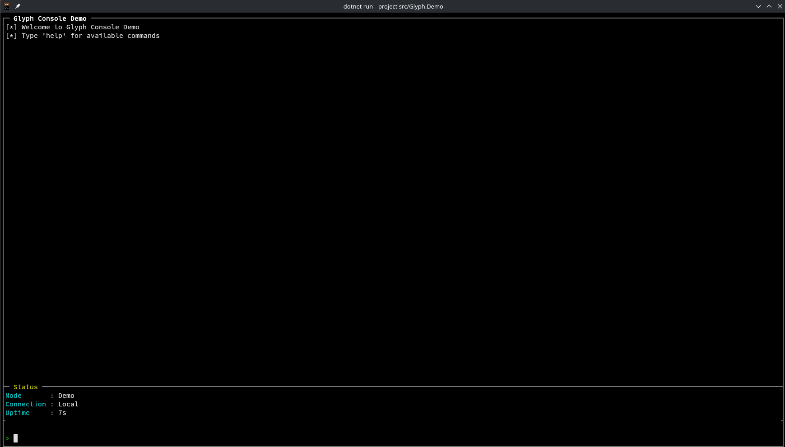
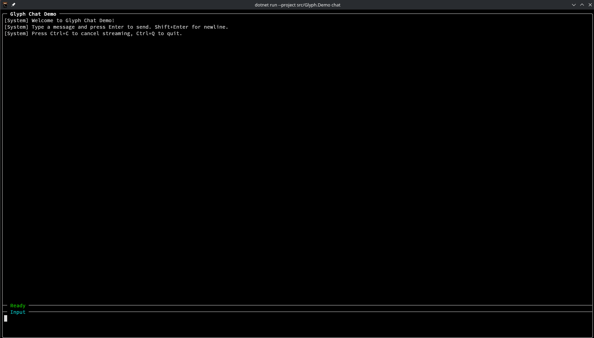
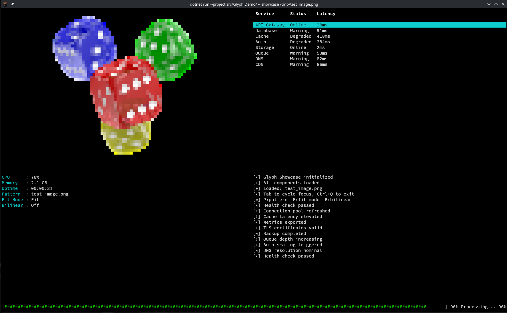
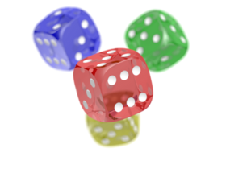

# Glyph

```
 ██████╗ ██╗  ██╗   ██╗██████╗ ██╗  ██╗
██╔════╝ ██║  ╚██╗ ██╔╝██╔══██╗██║  ██║
██║  ███╗██║   ╚████╔╝ ██████╔╝███████║
██║   ██║██║    ╚██╔╝  ██╔═══╝ ██╔══██║
╚██████╔╝███████╗██║   ██║     ██║  ██║
 ╚═════╝ ╚══════╝╚═╝   ╚═╝     ╚═╝  ╚═╝
```

**A zero-dependency, high-performance TUI framework for .NET**

[](https://dotnet.microsoft.com/)
[](LICENSE)
[]()

---

> Build beautiful terminal interfaces without any external dependencies



## Features

| Feature | Description |
|---------|-------------|
| **Rich Colors** | 16, 256, and 24-bit true color support |
| **Mouse Support** | Click, drag, and scroll wheel via SGR extended mode |
| **Advanced Input** | Shift+Enter, modifier keys, full keyboard handling |
| **Auto Resize** | Automatic terminal resize detection and re-layout |
| **Double Buffered** | Flicker-free rendering with diff-based updates |
| **Component Library** | Ready-to-use UI components and presets |
| **Image Rendering** | Half-block character image display with true color |
| **Image Loading** | Built-in PNG, BMP, PPM loaders - no external libraries |
| **AOT Compatible** | Native ahead-of-time compilation support |
| **Zero Dependencies** | Pure .NET - no native libraries required |

## 📦 Installation

```bash
git clone https://github.com/ItsNishi/Glyph.git
cd Glyph
dotnet build
```

**Add to your project:**
```xml
<ProjectReference Include="path/to/Glyph/src/Glyph/Glyph.csproj" />
```

**Run the demos:**
```bash
dotnet run --project src/Glyph.Demo -- console         # Console (status bottom)
dotnet run --project src/Glyph.Demo -- console-left    # Status panel on left
dotnet run --project src/Glyph.Demo -- console-right   # Status panel on right
dotnet run --project src/Glyph.Demo -- console-styled  # Custom colors
dotnet run --project src/Glyph.Demo -- chat            # Chat interface
dotnet run --project src/Glyph.Demo -- showcase        # Dashboard with all components
dotnet run --project src/Glyph.Demo -- showcase img.png # Dashboard with image file
dotnet run --project src/Glyph.Demo -- image           # Full-screen image viewer
dotnet run --project src/Glyph.Demo -- image photo.png # View a PNG/BMP/PPM file
```

**AOT native compilation:**
```bash
dotnet publish src/Glyph.Demo/ -c Release -r linux-x64
./src/Glyph.Demo/bin/Release/net10.0/linux-x64/publish/Glyph.Demo showcase
```

## 🏃 Quick Start

```csharp
using Glyph.Terminal;
using Glyph.Presets;

var console = new ConsoleWindow { Title = "My App" };
console.SetupLayout(Console.WindowWidth, Console.WindowHeight);

console.SetStatus("Status", "Running");
console.WriteInfo("Application started");
console.WriteSuccess("Ready");

console.CommandReceived += (s, e) =>
{
    console.WriteLine($"Command: {e.Command}");
};

Application.Run(console);
```

## Components

| Component | Description |
|-----------|-------------|
| `OutputView` | Scrollable text output with word wrap and auto-scroll |
| `TextInput` | Multi-line input (Enter=submit, Shift+Enter=newline) |
| `CommandInput` | Single-line command input with history |
| `StatusPanel` | Key-value display with auto-sizing columns |
| `TableView` | Data table with row selection and keyboard/mouse navigation |
| `ProgressIndicator` | Determinate progress bar or indeterminate spinner |
| `ImageView` | Half-block character image rendering with true color |
| `ImageLoader` | Zero-dependency PNG, BMP, PPM file loader |

## 🎨 Presets

### ConsoleWindow

Complete console layout with output, status panel, and command input.



**Layout Options:**
```csharp
console.StatusLayout = StatusLayout.Bottom;  // Horizontal row (default)
console.StatusLayout = StatusLayout.Left;    // Vertical column left
console.StatusLayout = StatusLayout.Right;   // Vertical column right

console.StatusPanelHeight = 4;   // For Bottom layout
console.StatusPanelWidth = 25;   // For Left/Right layout
```

**Color Theming:**
```csharp
var console = new ConsoleWindow
{
    Title = "Themed App",
    StatusLayout = StatusLayout.Right,
    BackgroundColor = Color.FromRgb(15, 20, 45),
    BorderColor = Color.FromRgb(100, 140, 200),
    TitleColor = Color.FromRgb(255, 220, 100),
    TextColor = Color.FromRgb(220, 230, 255),
    SeparatorLabelColor = Color.FromRgb(255, 150, 80)
};
```

### ChatWindow

Chat interface with streaming support for LLM/AI applications.



```csharp
var chat = new ChatWindow { Title = "AI Assistant" };
chat.SetupLayout(Console.WindowWidth, Console.WindowHeight);

chat.MessageReceived += async (s, e) =>
{
    chat.BeginStreaming();
    foreach (char c in response)
    {
        Application.Invoke(() => chat.AppendStreamingToken(c.ToString()));
        await Task.Delay(30);
    }
    Application.Invoke(() => chat.EndStreaming());
};

Application.Run(chat);
```

### Showcase

Dashboard demo combining all components: ImageView, TableView, StatusPanel, OutputView, and ProgressIndicator. All components animate with live data. Supports loading an image file or cycling through built-in test patterns.



```bash
dotnet run --project src/Glyph.Demo -- showcase              # Test patterns only
dotnet run --project src/Glyph.Demo -- showcase photo.png     # With image file
```

### Image Rendering

Display images in the terminal using half-block characters with true color.
Each cell renders two vertical pixels for maximum resolution.

**Test image used in showcase demo:**



```csharp
using Glyph.Terminal;

// Load an image file (PNG, BMP, PPM - no external dependencies)
var pixels = ImageLoader.Load("photo.png");

var imageView = new ImageView(0, 0, 80, 24);
imageView.SetPixels(pixels);
imageView.FitMode = ImageFitMode.Fit;      // Fit, Fill, or Stretch
imageView.UseBilinear = true;              // Bilinear vs nearest-neighbor scaling

// Or use built-in test patterns (no file needed)
imageView.SetPixels(ImageView.GenerateTestPattern(320, 240));
imageView.SetPixels(ImageView.GenerateColorBars(320, 240));
```

**Supported image formats:**

| Format | Details |
|--------|---------|
| PNG | All color types (RGB, RGBA, grayscale, indexed, 8/16-bit) |
| BMP | 24-bit and 32-bit uncompressed |
| PPM | P3 (ASCII) and P6 (binary), 8/16-bit |

**Fit modes:**

| Mode | Behavior |
|------|----------|
| `Fit` | Scale to fit within bounds, preserving aspect ratio (letterboxed) |
| `Fill` | Scale to fill bounds, preserving aspect ratio (cropped) |
| `Stretch` | Scale to exactly match bounds, ignoring aspect ratio |

## Colors

```csharp
// Standard 16 colors
Color.Red, Color.BrightGreen, Color.Cyan

// 256-color palette
Color.From256(208)  // Orange

// True color (24-bit RGB)
Color.FromRgb(255, 128, 0)
Color.FromHex("#FF8000")

// RGB accessors
byte r = color.R;
byte g = color.G;
byte b = color.B;
bool isTrueColor = color.IsTrueColor;

// Color interpolation
var mid = Color.Lerp(Color.FromRgb(255, 0, 0), Color.FromRgb(0, 0, 255), 0.5f);

// Text attributes
Screen.DrawString(x, y, "Bold!", Color.White, Color.Default, TextAttribute.Bold);
```

## Keybindings

| Key | Action |
|-----|--------|
| `Tab` / `Shift+Tab` | Cycle focus |
| `Enter` | Submit input |
| `Shift+Enter` | Insert newline (TextInput) |
| `Ctrl+C` | Cancel/Clear |
| `Ctrl+Q` | Quit application |
| `Ctrl+L` | Clear output |
| `j` / `k` | Vim-style scroll |
| `g` / `G` | Jump to top/bottom |
| `P` | Cycle image patterns (showcase/image demos) |
| `F` | Cycle fit modes (showcase/image demos) |
| `B` | Toggle bilinear filtering (showcase/image demos) |

## Project Structure

```
Glyph/
├── src/
│   ├── Glyph/                    # Main library (zero dependencies)
│   │   ├── Terminal/             # Core TUI engine
│   │   ├── Components/           # UI components
│   │   │   ├── ImageView.cs     # Half-block image rendering
│   │   │   ├── ImageLoader.cs   # PNG/BMP/PPM file loading
│   │   │   ├── TableView.cs     # Data table with selection
│   │   │   ├── OutputView.cs    # Scrollable text output
│   │   │   ├── StatusPanel.cs   # Key-value display
│   │   │   ├── ProgressIndicator.cs  # Progress bar / spinner
│   │   │   ├── TextInput.cs     # Multi-line text input
│   │   │   └── CommandInput.cs  # Single-line command input
│   │   ├── Presets/              # Ready-to-use layouts
│   │   └── Backends/             # Streaming backends
│   └── Glyph.Demo/               # Demo application (AOT-enabled)
└── docs/                         # Documentation
```

## 📚 Documentation

- [Architecture Overview](docs/architecture.md) - Core concepts and design
- [Components Guide](docs/components.md) - Component reference
- [Layouts](docs/layouts.md) - Layout system and positioning
- [Styling & Colors](docs/styling.md) - Colors, attributes, and theming
- [Input Handling](docs/input.md) - Keyboard and mouse events
- [Custom Components](docs/custom-components.md) - Building your own
- [Backends](docs/backends.md) - Streaming data sources

## 🔧 Requirements

- .NET 10 SDK
- Terminal with ANSI support (most modern terminals)
- No native dependencies - works out of the box on Windows, Linux, and macOS

## 📄 License

This project is licensed under the [MIT License](LICENSE).

---

<p align="center">
  <strong>Built with ❤️ for the terminal</strong>
</p>
